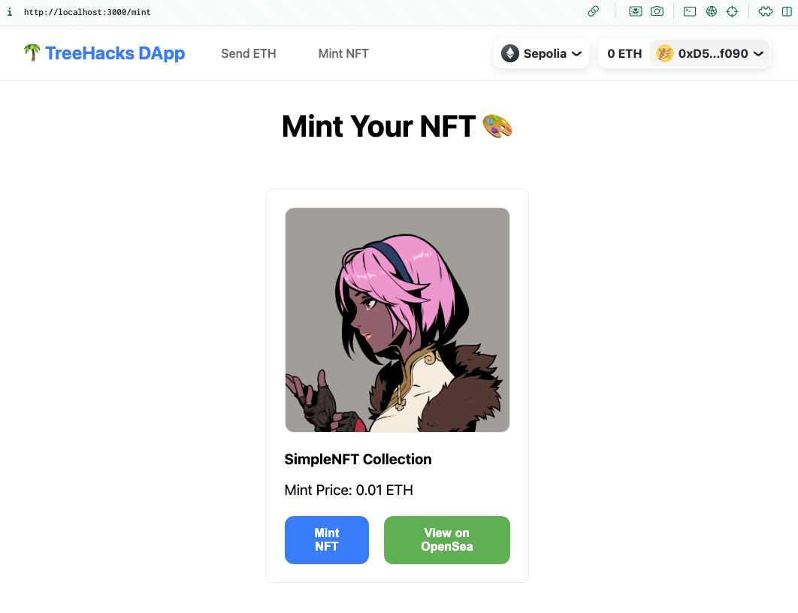

# TreeHacks Web3 Workshop DApp

This project is a comprehensive Web3 application built for the TreeHacks Web3 Workshop. It demonstrates how to build a decentralized application using modern Web3 tools and frameworks, featuring both frontend and smart contract development.

## Project Overview



The DApp consists of two main components:
- A frontend application for ETH transfers and NFT minting
- Smart contracts including a basic ERC721 NFT deployer contract


### Features

- Wallet connection using RainbowKit
- ETH transfer functionality on Sepolia testnet
- NFT minting capability
- Transaction status tracking
- Etherscan transaction verification
- Smart contract testing with Hardhat

## Project Structure
```
treehacks-dapp/
├── frontend/ # Next.js frontend application
│ ├── src/
│ │ ├── components/ # React components
│ │ ├── pages/ # Next.js pages
│ │ ├── styles/ # CSS modules
│ │ └── wagmi.ts # Wagmi configuration
│ └── package.json
├── contracts/ # Solidity smart contracts
│ ├── Lock.sol # Basic lock contract
│ └── simple-nft-sale.sol # NFT contract
├── scripts/ # Contract deployment scripts
├── test/ # Contract test files
├── ignition/ # Hardhat Ignition deployment modules
└── hardhat.config.ts # Hardhat configuration
```


## Tech Stack

- [RainbowKit](https://rainbowkit.com) - Wallet connection and management
- [wagmi](https://wagmi.sh) - Ethereum interactions
- [Next.js](https://nextjs.org/) - React framework
- [Viem](https://viem.sh) - Ethereum utilities
- [Hardhat](https://hardhat.org) - Smart contract development
- [OpenZeppelin](https://openzeppelin.com) - Smart contract libraries

## Getting Started

### Prerequisites
- Node.js 18+ installed
- MetaMask or another Web3 wallet with Sepolia testnet access where you have access to a private key
- Some Sepolia testnet ETH (get from [Sepolia Faucet](https://sepoliafaucet.com))

1. Clone this repository

2. Install dependencies in both root and frontend directories:
```bash
npm install
cd frontend && npm install
```

3. Run the frontend:
```bash
cd frontend && npm run dev
```

4. Connect your wallet and start interacting with the DApp!

## Smart Contract Development
For detailed instructions on local development and testing with Hardhat, see our [Hardhat Guide](docs/HARDHAT.md). This guide covers:
- Setting up a local blockchain
- Deploying contracts locally
- Running tests
- Connecting your wallet to the local network
- For deploying to Sepolia testnet, see our [Testnet Deployment Guide](docs/TESTNET.md)

## Contributing

This is a workshop demonstration project. Feel free to fork and modify for your own learning purposes!

## License

MIT

